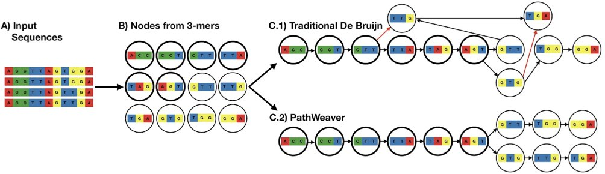
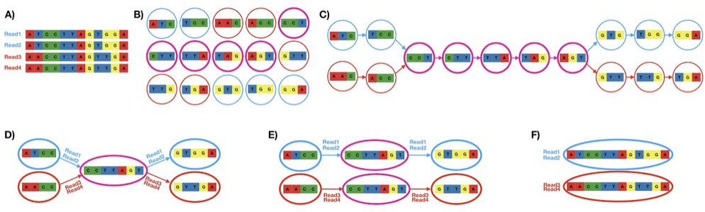
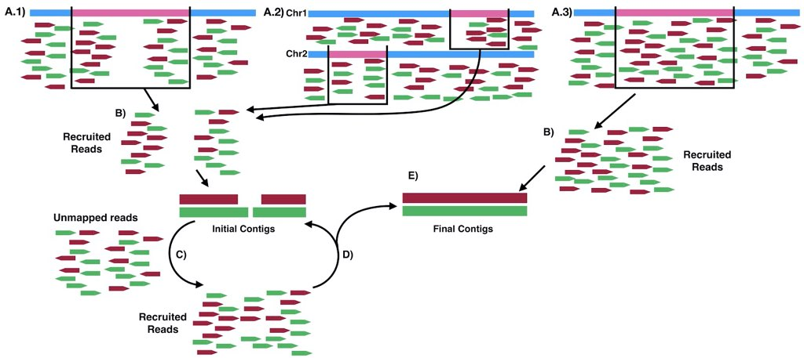

# PathWeaver
A suite of tools for local haplotype reconstruction

# Primary Goal
PathWeaver was specifically designed to reconstruction local haplotypes from microbial populations (e.g. *Plasmodium* species) especially within complex infections where multiple closely related strains can be found. The approach tries to preserve even down to a one-base difference between the strains to get all haplotypes within the infection, this differs from normal assembly which would collapse on these small differences in order to build longer contigs. This approach is also useful for assembly multi-gene families where there may be large amount of conserved sequence between genes within the same family (e.g. *var* genes within *Plasmodium falciparum*), traditionally approaches may erroneously create chimeric sequence between similar genes.  

# Method
PathWeaver uses a De Brujin graph based approach to reconstructing haplotypes. While building the graph PathWeaver saves the read information from which k-mer nodes are created and in this way only connects nodes that were found to be connected within the input data. Example of this is shown below where in C.1 in a traditional approach there would have been two connections (red arrows) between nodes that share prefix and suffix that weren't shown to be connected in the input data.  



In addition, by saving the read information that connects k-mer nodes, pathways through bubble nodes can be determined by utilizing which shared reads connect the possible different nodes before and after a shared node (shown below).  



## Input 
There are 4 different ways input data can be supplied to PathWeaver. One is to simply supply a fastq with sequences with which to construct haplotypes. The other 3 methods utilized alignments to a reference genome to assembly specific regions of interest from whole genome sequencing without having to try to assembly the whole genome. All 3 methods are demnostrated below. 

* **A.3** - Reads are recruited from a single region of interest and are used for haplotype reconstruction. 
* **A.1** - Reads are recruited from a single region like **A.3** but due to high diversity within in the region several of the reads belong to this region may have ended up in the unmapped reads in the alignment, therefore, once initial contigs are built, the unmapped reads are then aligned to these initial contigs to recruit other reads that may belong to the region.  
* **A.2** - For multi-gene families, reads can end up being mapped to different closely related genes within the family and therefore all reads from genes within the family need to be recruited to fully assembly the haplotypes belonging to all the genes within the family. High diversity within these genes like **A.1** above may have caused some of these reads to be unmapped so unmapped reads are then aligned to the initially assembled contigs to further recruit reads belonging to the family.   




# Install 
PathWeaver is written in c++ but its install setup scripts are written in Python3. Within the repository is an install script that can be used which will download PathWeaver's dependencies. The only things that need to be present first are Python3, cmake, and a modern c++ complier that can handle c++17 or above. 

```bash
git clone https://github.com/nickjhathaway/PathWeaver.git 
cd PathWeaver 
./install.sh 

bin/PathWeaver
```
For running the methods within PathWeaver, **bwa** and **samtools** also need to be installed. 

# Usage
As stated there are several different methods for running assembly with PathWeaver and below are some examples. 

## Regions of interest

Bed file can be one region or multiple, if multiple regions are given then a separated haplotype reconstruction is conducted for each region and final haplotypes are trimmed to that region.  

One region  

```bash
PathWeaver BamExtractPathawaysFromRegion --bed PF3D7_1133400-1.bed --primaryGenome Pf3D7 --genomeDir pfGenomes/genomes/ --bam 7G8.sorted.bam --dout Pf3D7_11_v3-1293855-1295724_ama1/7G8_Pf3D7_09_v3-1201811-1206974_msp1
```

Multiple regions  
```bash
PathWeaver BamExtractPathawaysFromRegion --bed ama1_cps_trap.bed --primaryGenome Pf3D7 --genomeDir pfGenomes/genomes/ --bam 7G8.sorted.bam --dout ama1_cps_trap/7G8_ama1_cps_trap  
```

## Regions with additional recruit of unmapped reads

Bed file can one region or multiple regions, reads will be pulled from all provided regions and used one reconstruction 

One region 

```bash
PathWeaver ExtractPathWaysReadsFallingInMultipleRegions --bed PF3D7_0930300-1.bed --primaryGenome Pf3D7 --genomeDir pfGenomes/genomes/ --bam 7G8.sorted.bam --dout Pf3D7_09_v3-1201811-1206974_msp1/7G8-02_Pf3D7_09_v3-1201811-1206974_msp1 --maxIteration 20
```

Multiple regions

```bash
PathWeaver ExtractPathWaysReadsFallingInMultipleRegions --bed pfvars_exon1_withUpstream.bed --primaryGenome Pf3D7 --genomeDir pfGenomes/genomes/ --bam 7G8.sorted.bam --dout VarExon1ShortUpstream/7G8-02_VarExon1ShortUpstream --maxIteration 20
```

## From raw sequence files

```bash
PathWeaver SeqsExtractPathaways --fastq1 out_R1.fastq --fastq2 out_R2.fastq --sampName example --dout outExample --overWriteDir --revCompMate
```


